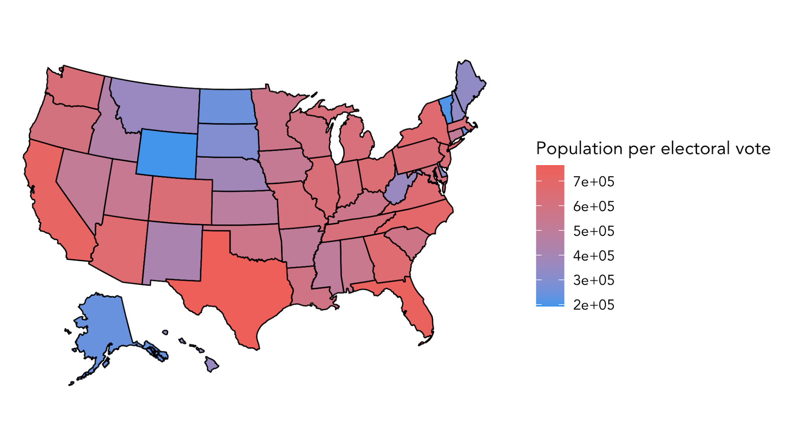

# Introduction: The Electoral College
### September 14, 2020

As we witnessed during the 2016 presidental election season, predicting a presidential election's outcome is difficult. Scholars have put forth numerous theories, with many factors that may help to determine who will win, yet there is always room for surprises and uncertainty. To set the scene for our prediction model, we begin by exploring the system we have in place for selecting our country's president — the electoral college system — and its consequences. Next week we will begin building our predictive model.

### Popular Vote vs. Electoral Vote

Let's look at presidential elections from 1948 to 2016. Below shows the popular vote distribution, where the x-axis represents vote share of the major two parties.

However, as we know, winning the popular vote does not determine the winner of the election. Below shows the electoral vote distribution. Because the total number of electoral votes has changed within the included time period, the x-axis represents electoral votes as a percentage, similar to above.

Since 1948, there have been two years - 2000 with George W. Bush and Al Gore and 2016 with Donald Trump and Hillary Clinton - in which the winner of the election was not the winner of the popular vote.

Considering the two figures together, we can see that the electoral college system greatly dramatizes the margins by which the winner actually wins. This leads us to explore the next question.

### Is the Electoral College System Biased?

In the electoral college system, the number of electoral votes a state has ranges from three in less populated states like Wyoming to fifty-five in California, the highest populated state. However, the [ratio](https://en.wikipedia.org/wiki/List_of_states_and_territories_of_the_United_States_by_population#cite_note-8) of a state's population to electoral votes varies quite widely. Below we map this proportion, with higher proportions shaded red and lower proportions shaded blue.

It is clear that there are large discrepancies among the states: Wyoming has one electoral vote for approximately every 200,000 residents, whereas California has one electoral vote per over 700,000 residents. Thus, residents of Wyoming are over three times more represented under the electoral college than residents of California.

Some have deemed this the [small-state bias](https://www.washingtonpost.com/graphics/politics/how-fair-is-the-electoral-college/) of the electoral college system, which may have been a deciding factor in the 2000 election. 

However, the small-state bias [does not explain](https://www.nytimes.com/2019/03/22/upshot/electoral-college-votes-states.html) Trump's win over Clinton in 2016. Rather, the winner-take-all nature of the electoral college amplifies the margins by which a candidate wins, as seen in the first two figures. In other words, a candidate need only to win a slight majority of popular votes in a state to win all of its electoral votes; in a state like California, this means that the candidate wins a massive fifty-five electoral votes.

Regardless of the relative strength of these two phenomena, different viewpoints and understandings of them have implications on where candidates choose to focus their campaigning efforts. Candidates' ground operations is something that we will look into further in the coming weeks.
