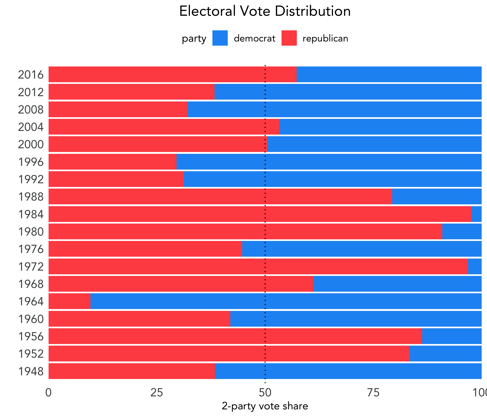

# Introduction: The US Presidential Election System
### September 14, 2020

The US follows the electoral college system to determine our country's president. Currently, there are 538 electoral votes, where each state is allocated a vote for each of its representatives in Congress; thus, the winner must garner at least 270 electoral votes.

### Popular Vote vs. Electoral Vote

Let's look at presidential elections from 1948 to 2016. Below shows the popular vote distribution, where the x-axis represents vote share of the major two parties.

However, as we know, winning the popular vote does not determine the winner of the election. Below shows the electoral vote distribution. Because the total number of electoral votes has changed within the included time period, I chose to represent electoral votes as a percentage, like above.

Since 1948, there have been two years - 2000 with George W. Bush and Al Gore and 2016 with Donald Trump and Hillary Clinton - in which the winner of the election was not the winner of the popular vote.

Taken together, we can see from both of the above figures that the electoral college system can greatly dramaticize the margins by which the winner actually wins.

### Is the Electoral College System Biased?

Given that the 

Popular             |  Electoral
:-------------------------:|:-------------------------:
  |  
