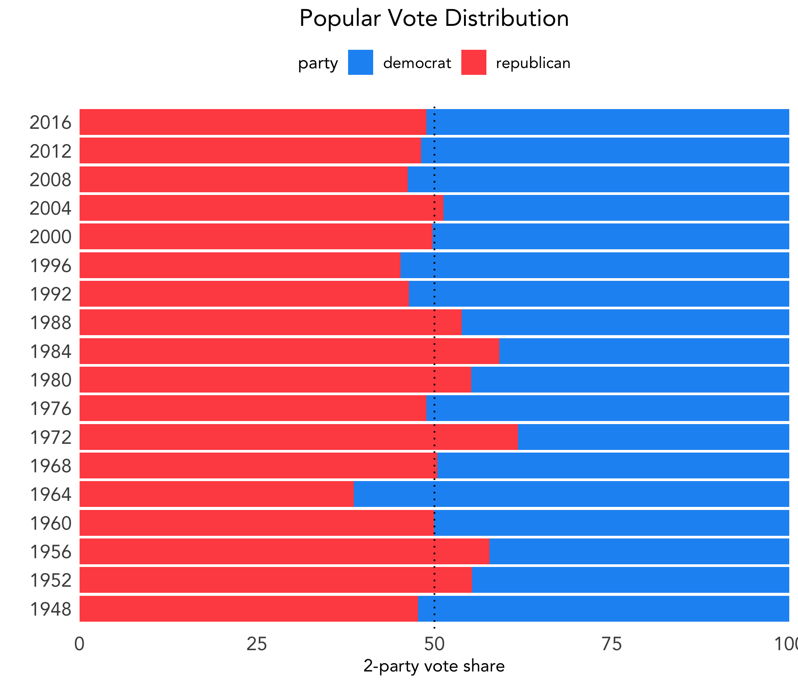
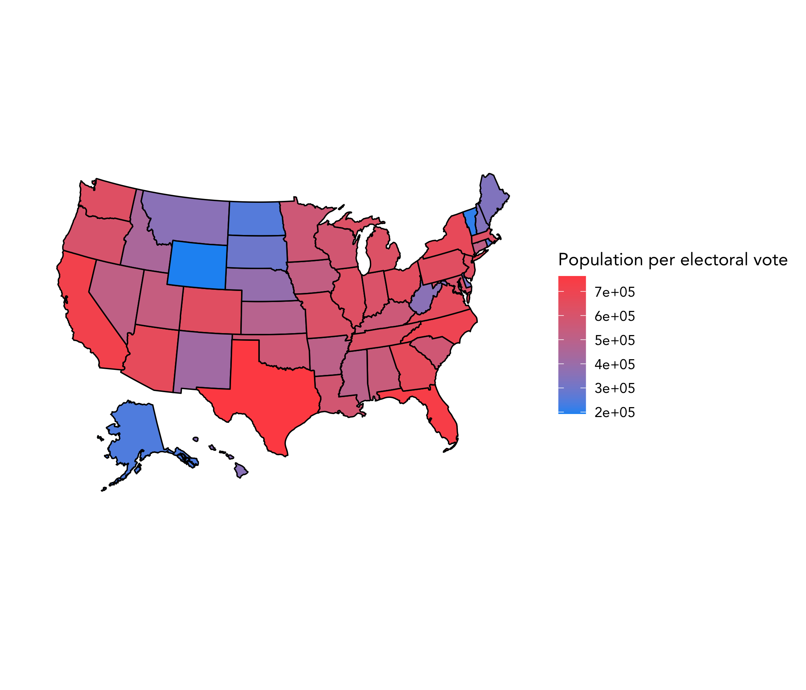

# Introduction: The Electoral College
### September 14, 2020

We begin by exploring the consequences of having the electoral college system for selecting our country's president.

### Popular Vote vs. Electoral Vote

Let's look at presidential elections from 1948 to 2016. Below shows the popular vote distribution, where the x-axis represents vote share of the major two parties.

However, as we know, winning the popular vote does not determine the winner of the election. Below shows the electoral vote distribution. Because the total number of electoral votes has changed within the included time period, the x-axis represents electoral votes as a percentage, similar to above.

Since 1948, there have been two years - 2000 with George W. Bush and Al Gore and 2016 with Donald Trump and Hillary Clinton - in which the winner of the election was not the winner of the popular vote.

Considering the two figures together, we can see that the electoral college system greatly dramaticizes the margins by which the winner actually wins. This leads us to explore the next question.

### Is the Electoral College System Biased?

In the electoral college system, the number of electoral votes a state has ranges from 3 in less populated states like Wyoming to 55 in California, the highest populated state. However, the [ratio](https://en.wikipedia.org/wiki/List_of_states_and_territories_of_the_United_States_by_population#cite_note-8) of a state's population to electoral votes varies quite widely. Below we map this proportion, with higher proportions shaded red and lower proportions shaded blue.

It is clear that there are large discrepancies among the states: Wyoming has one electoral vote for approximately every 200,000 residents, whereas California has one electoral vote per over 700,000 residents. Thus, residents of Wyoming are over three times more represented under the electoral college than residents of California.

Some have deemed this the [small-state bias](https://www.washingtonpost.com/graphics/politics/how-fair-is-the-electoral-college/) of the electoral college system. This may have implications on where candidates choose to focus their campaigning efforts, something that we will look further into in a few weeks.

However, the small-state bias [does not explain](https://www.nytimes.com/2019/03/22/upshot/electoral-college-votes-states.html) Trump's win over Clinton in 2016.

Next week we will begin building our predictive model.
