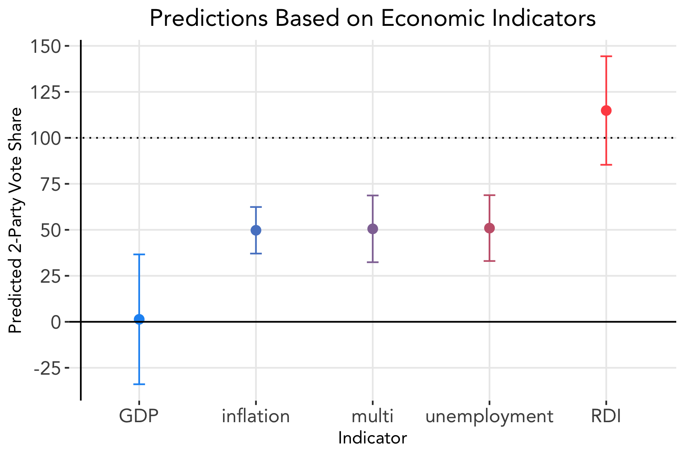
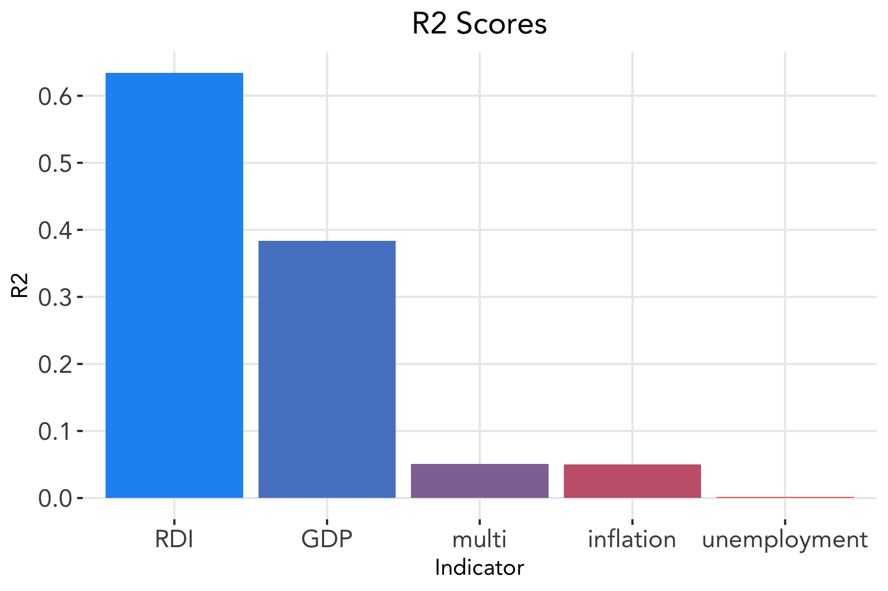
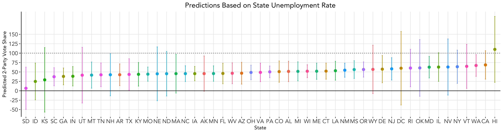

# Economic Indicators
### September 21, 2020

This week we begin building our predictive model using economic indicators. Voters often use past results to make inferences about the future, and measures surrounding the state of the economy are some of the most easily obtained, and thus most used, features to make these judgments. However, voters focus on the near past, not the entire four-year term of the sitting president. For instance, if unemployment rates are high at the beginning of a president's term but low in the time period leading up to an election, voters may still view him favorably and be more likely to vote for the incumbent party in the next election. This has implications both on how we should set up our model but also on how candidates choose to portray themselves during campaign season.

### Economic Retrospection: A Coin Toss

In their book _Democracy for Realists_, [Achen and Bartels](https://www.jstor.org/stable/j.ctvc7770q) conclude that during presidential elections, voters essentially "toss a coin" to select a winner. This statement follows from the theory of **economic retrospection**, the tendency for voters to reward or punish the incumbent president's party based on their perceptions of how the economy and their personal welfare are doing. This can be a positive sign that voters are making rational decisions grounded in evidence. However, as [Healy and Lenz](https://www.jstor.org/stable/24363467) show, voters may be misled due to the nature of human thinking and heuristics; in fact, only the six months leading up to the election are what really affects voters' decisions, not the entire span of the presidency.

#### Economic Voting Model: National

Given the above findings, we construct our models using data collected in quarters two and three of election years. We fit a simple linear model between two-party vote share and each of the following economic indicators: gross domestic product (GDP) growth rate, real disposable income (RDI) growth rate, unemployment rate, and inflation rate. For RDI growth rate, the data includes election years from 1960 to 2016; for all others, the data spans election years 1948—2016. The goal of each model is to predict the incumbent party's two-party popular vote share for the 2020 election.

We choose to fit each of the above models to just one variable at a time because the economic indicators are interrelated and may exhibit a high degree of multicollinearity. Just to see the effects of including more than one variable, we also fit a multivariate regression with both the unemployment rate and the inflation rate included. The correlation measure between the two variables is 0.33.

Below displays the incumbent party's (Republican) predicted two-party popular vote share in the 2020 election for each of the models with 95% confidence intervals. The multivariate regression is labeled as "multi."

Note that for the multivariate regression, the size of the confidence interval increased, so it does not appear that including both variables improves our model.

We also calculate the R-squared value, which measures how much of the variation in vote share can be explained by the model, for each of the models.

Consistent with what Achen and Bartels find, RDI exhibits the greatest predictive power among the economic indicators, followed by GDP. Unemployment and inflation appear to have little predictive power. 

However, from the first figure we see that both GDP and RDI produce nearly impossible estimates, with the latter predicting a vote share about 100%. Why do we see such large discrepancies between the predictive power of the different models? For one, 2020 has been far from a normal year; with COVID-19, the economy experienced the [largest GDP decrease](https://www.nytimes.com/2020/07/30/business/economy/q2-gdp-coronavirus-economy.html) in history. Thus, using data from 1948 to 2016 in which such an economic shock did not occur may not yield the best predictive model for our current economic climate.

#### Economic Voting Model: Local

We test if economic indicators, specifically unemployment rate, at the state level yield more reliable predictions. Using the same method as before, we test this out by fitting a linear model to the unemployment rate data for each state. Below displays the predicted two-party popular vote share in the 2020 election for each state with 95% confidence intervals.

There is wide variance across states, with some states predicting vote shares above 100%, and many confidence intervals including values below 0% or above 100%. We can again attribute the large degrees of uncertainty partially to the unprecedented unemployment rates we have been seeing due to the COVID-19 pandemic. Across all 50 states, the average prediction interval is (11.4, 89.5) with a mean of 50.5, and the R-squared values are all lower than 0.33. It appears that predicting on state level does not improve the predictive power of our models, nor does it decrease uncertainty.

### Implications of Retrospective Voting

Aside from affecting what data we choose to include in our model, retrospective voting has significant implications on the actions of presidents seeking reelection and on campaigning efforts of opponents. With the knowledge that voters base their decisions off of short-term outcomes, sitting presidents may implement policies to stimulate the economy in the short-run but that may not necessarily benefit the economy in the long-run. Some may even argue that this implies there is little incentive for presidents to perform well early on in their term.

Nevertheless, Healy and Lenz stipulate that voters do intend to base their decisions off of long-run outcomes. If provided with easily accessible and understandable information about economic performance over a longer period of time, voters would make more rational, informed decisions under the retrospective model. This finding can prompt possible solutions to decreasing the emphasis placed on election year outcomes.
