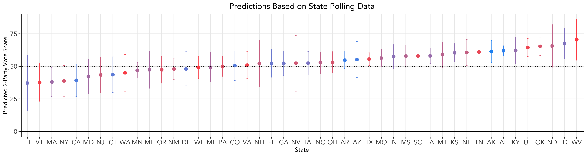
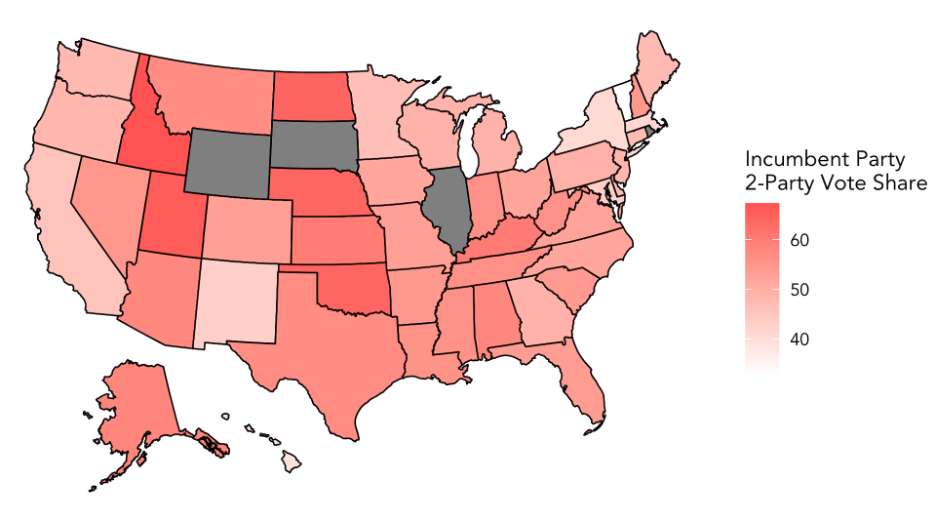
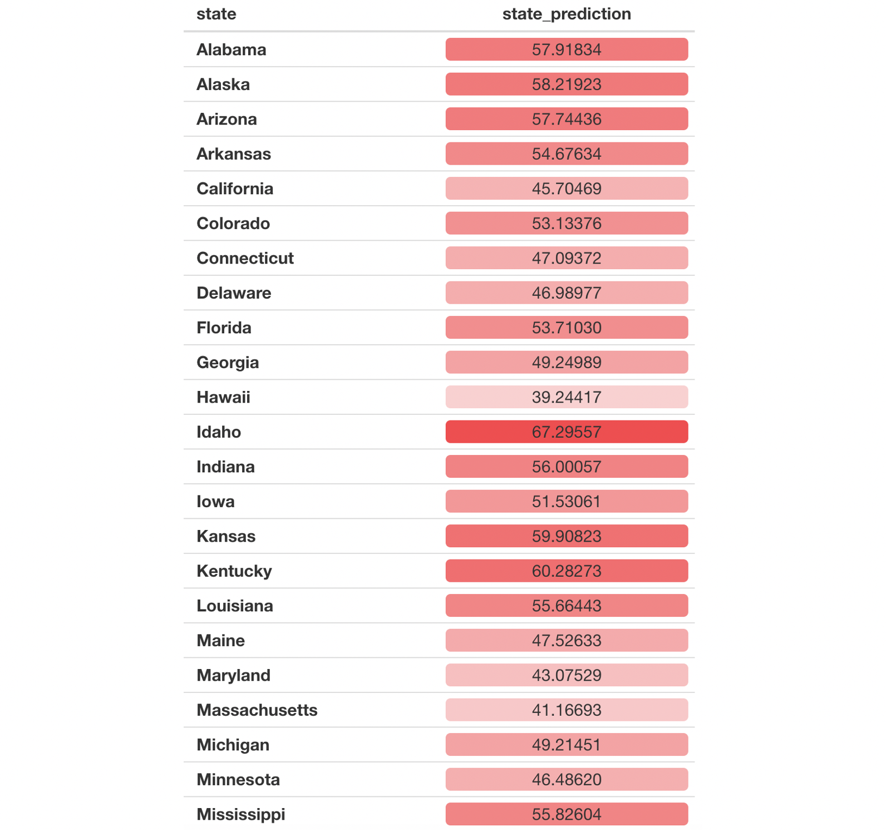
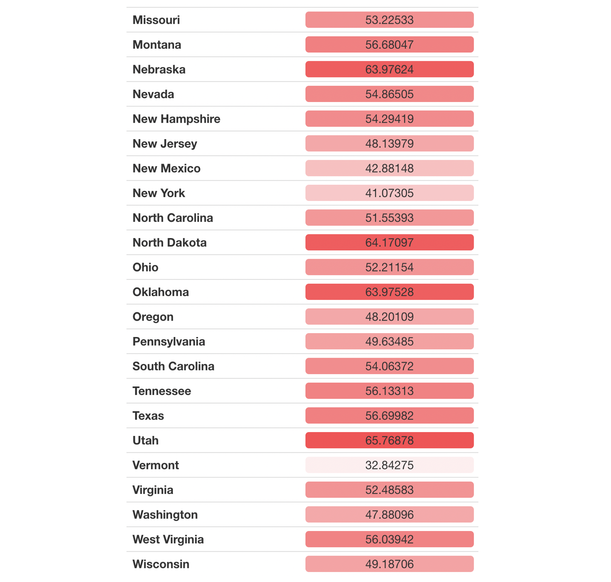

# Polling
### September 28, 2020

As we saw last week, economic indicators alone may not be highly predictive of presidential election outcomes, especially during this time. One way to improve our model is to use polling data, since these theoretically reflect who poll respondents may actually vote for. Thus, we add on to our economic model from last week with support shown for each candidate through aggregate polling data.

### Building a Model using Polling Data

Given state level polling data, we aggregate all of the polling data by state and year and build separate models for each state. Then, we use 2020 polling data to predict the incumbent party's vote share for the 2020 election. The polling data included in our model only include polls completed within 60 days of the election.

Compared to last week's state level predictions, this polling model shows improved accuracy, given that no prediction intervals include values below 0 or above 100 as some did in our economic indicators model. Overall, **Trump is predicted to win 29 states** per this model.

### Weighted Ensemble: Incorporating Economic Data

We can also create a weighted ensemble where we incorporate both polling data and economic indicators from last week. Following [FiveThirtyEight](https://projects.fivethirtyeight.com/2020-election-forecast/)'s method, we give polling data more weight relative to economy data as the election draws closer. The weight the polling data receives in our model grows exponentially as time goes on. At the time of running this model, there were 37 days left until the election. Given what we learned last week, we select GDP growth in the 2nd quarter of election years as our economic indicator. It is important to note that the GDP growth used is at the national level, not the state level, and thus does not account for the important local variations we see in the indicator.

The following map shows the incumbent party predicted 2-party vote share for each state, with deeper tints of red indicating a higher predicted vote share. Illinois, Rhode Island, South Dakota, and Wyoming are shaded gray on the map because their data was not included in the polling dataset and thus we are not able to make predictions for those states.

Here are the prediction numbers:

Some interesting findings to point out:
* This model predicts **Trump to win the popular vote in 28 states**. The one state that differs from the poll-only model is Georgia.
* In states considered solidly democratic per the [New York Times](https://www.nytimes.com/interactive/2020/us/elections/election-states-biden-trump.html) such as California, Hawaii, New York, and Vermont, this model predicts incumbent party vote share as at least a few percentage points below 50%.
* In states considered solidly republican such as Idaho, Nebraska, North Dakota, and Oklahoma, this model predicts incumbent party vote share many percentage points above 50%.
* Swing states **Florida, Iowa, North Carolina are predicted to go to Trump**, while **Georgia, Pennsylvania, Michigan, and Wisconsin are predicted to go to Biden**. 

### Caveats to Polling Data

It is important to acknowledge a few caveats to using polling data in our prediction model. Polls vary greatly in quality - depending on factors including how the poll was conducted, how the polling sample was drawn, and wording of poll questions, the relative support for political candidates that we gather from polls may not be accurate. Even if the polling data we use is representative of the population, the _voting_ population this year may be different due to factors related to the pandemic.

Nevertheless, as Gelman and King suggest, "much evidence exists to conclude that survey responses are related to actual voting." Aggregated polling data can help us uncover useful information about voters, especially as the election draws closer.
