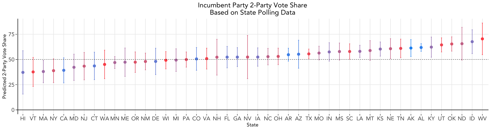

# Polling
### September 28, 2020

As we saw last week, economic indicators alone may not be highly predictive of presidential election outcomes, especially during this time. One way to improve our model is to use polling data, since these theoretically reflect who poll respondents may actually vote for. Thus, we add on to our economic model from last week with support shown for each candidate through aggregate polling data.

### Why Use Polls

### Building a Model using Polling Data

Given state level polling data, we aggregate all of the polling data by state and year and build separate models for each state. Then, we use 2020 polling data to predict the incumbent party's vote share for the 2020 election. The polling data included in our model only include polls completed within 60 days of the election.

Compared to last week's state level predictions, this polling model shows improved accuracy, given that no prediction intervals include values below 0 or above 100 as some did in our economic indicators model. We can see that...

### Weighted Ensemble: Incorporating Economic Data

We can also create a weighted ensemble where we incorporate both polling data and economic indicators from last week. Following 538's method, we give polling data more weight relative to economy data as the election draws closer. The weight the polling data receives in our model grows exponentially as time goes on. At the time of running this model, there were 37 days left until the election. Given what we learned last week, we select GDP growth in the 2nd quarter of election years as our economic indicator.

The following map shows the incumbent party predicted 2-party vote share for each state, with deeper tints of red indicating a higher predicted vote share. Illinois, Rhode Island, South Dakota, and Wyoming are shaded gray on the map because their data was not included in the polling dataset and thus we are not able to make predictions for those states.

A number of interesting trends jump out:

### Caveats to Polling Data
