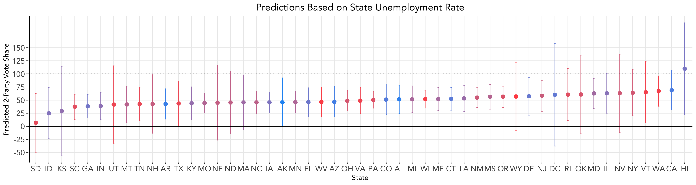

# Polling
### September 28, 2020

As we saw last week, economic indicators alone may not be highly predictive of presidential election outcomes, especially during this time. One way to improve our model is to use polling data, since these theoretically reflect who poll respondents may actually vote for. Thus, we add on to our economic model from last week with support shown for each candidate through aggregate polling data.

### Why Use Polls

### Building a Model on Polling Data

### Caveats

