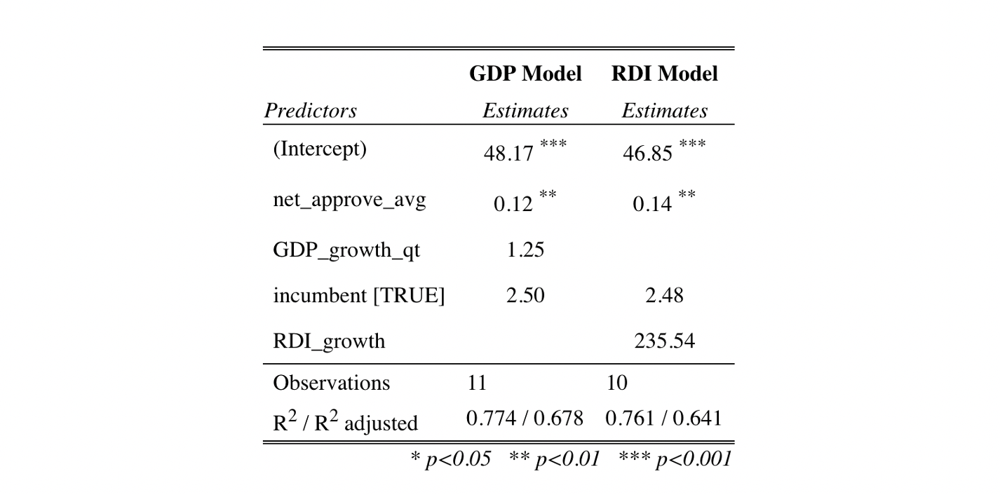
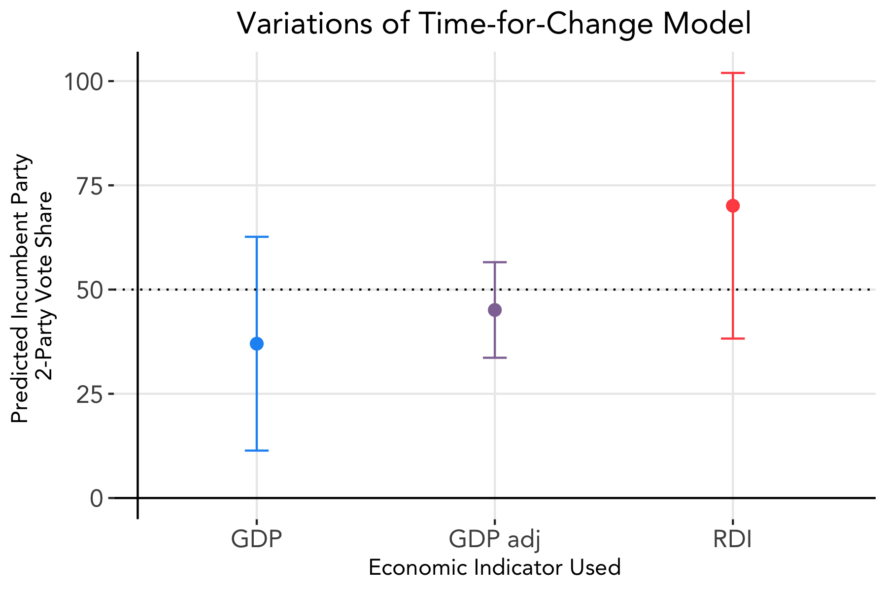

# Incumbency
### October 5, 2020

Incumbency is often cited as an influential factor in election outcomes. In fact, for the seventeen post-war presidential elections thus far (1952 to 2016), an incumbent president has run for re-election eight times and only lost twice. This week, we look at whether adding an incumbency indicator variable affects our predictions as well as whether the supposed incumbency advantage applies to this year's presidential election.

### The Time-for-Change Model

A well-known model that incorporates incumbency is [Alan Abramowitz's time-for-change model](https://www.cambridge.org/core/journals/ps-political-science-and-politics/article/will-time-for-change-mean-time-for-trump/6DC38DD5F6346385A7C72C15EA08CA09/share/f8ca1223dd58ec9ae27b68154beb52ec9c320cd8), which uses three variables to generate vote share predictions:
* **GDP growth rate** in 2nd quarter of election year
* Incumbent party's **net approval rating** from the final Gallup poll in June of election year
* Indicator variable for whether an **incumbent president** is running (1 if yes, 0 if no)

Using this model as inspiration, we create multivariate linear regression models using an economic indicator (GDP growth rate or RDI growth rate), the incumbent party candidate's net approval rating, and an indicator variable for presence of an incumbent candidate. As we saw last week, polling data may become more representative of constituents' actions as elections draw nearer; thus, in an effort to use approval ratings closest to the election, we use Gallup poll results with ending dates in the month of October and calculate the average. Based on the data available, there are eleven years included in our model: 1952, 1960, 1968, 1984, 1992, 1996, 2000, 2004, 2008, 2012, and 2016. From Week 2: Economic Indicators, we saw that RDI growth rate displayed higher predictive power than GDP growth rate, similar to Achen and Bartels' findings, so we test two different models, one using GDP growth rate as the Time-for-Change Model does, and a variation using RDI growth rate.

Below are the summaries of the two models:

To predict, we use the latest Gallup poll ratings available for 2020, which come from July, and GDP and RDI growth rates from quarter two of this year. However, as we saw in Week 2, the effects of the pandemic on economic indicators has made it much harder to produce accurate predictions using this year's raw numbers. As a result, we adjust the quarter two GDP growth rate to 40% of the next-lowest GDP growth rate (quarter four of 2008), following the adjustment that [The Economist](https://projects.economist.com/us-2020-forecast/president/how-this-works) made in their predictions. The below figure shows the results from the GDP-based model using both the real GDP growth rate value and the adjusted GDP growth rate value, and the RDI-based model using the real RDI growth rate value.

**The time-for-change model using the true GDP growth rate predicts Trump to win 37.0% of the two-party popular vote**, whereas **the time-for-change model using RDI growth rate predicts Trump to win 70.1%**. However, both predictions generate wide margins of error, with the lower and upper bounds of the GDP model and RDI model being 11.4% and 62.7%, and 38.2% and 102.0%, respectively.

**Using the adjusted GDP growth rate, however, yields a predicted two-party popular vote for Trump at 45.1%**, with lower and upper bounds of 33.6% and 56.6%, respectively.

Compared to our models from Week 2: Economic Indicators, which only included GDP and/or RDI, these models show improvement in that the predictions yield more realistic results (closer to 50%) with slightly smaller confidence intervals. In other words, including polling data and the incumbent indicator variable may improve predictive power.

### Trump and Incumbency

Incumbents usually face a number of structural advantages, with main factors being that incumbent's have **greater access to funding** and **a head start on campaigning**. Trump made it clear that he would run for re-election on [the day of his inauguration](https://www.nytimes.com/2020/09/07/us/politics/trump-election-campaign-fundraising.html) in hopes of creating a sizable financial lead between him and his to-be-determined opponent. When Biden became the democratic nominee, he did have some catching up to do, but Biden has been able to [raise more money](https://www-washingtonpost-com.ezp-prod1.hul.harvard.edu/politics/trump-reelection-incumbency-biden/2020/09/12/ics/trump-reelection-incumbency-biden/2020/09/12/f19504ae-f4f8-11ea-b796-2dd09962649c_story.html), and perhaps spend it more tactfully, than the Trump campaign.

This year in particular marks a drastically different landscape as repercussions of the pandemic continue to play out. We will consider the impact of shocks like the pandemic as well as the effects campaigning in the upcoming weeks.
