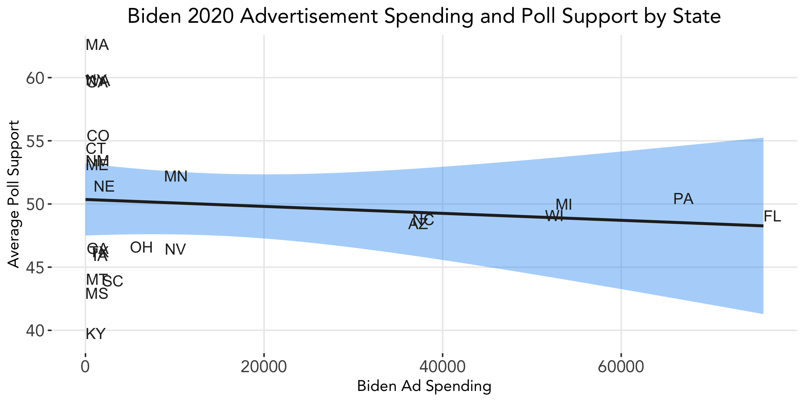
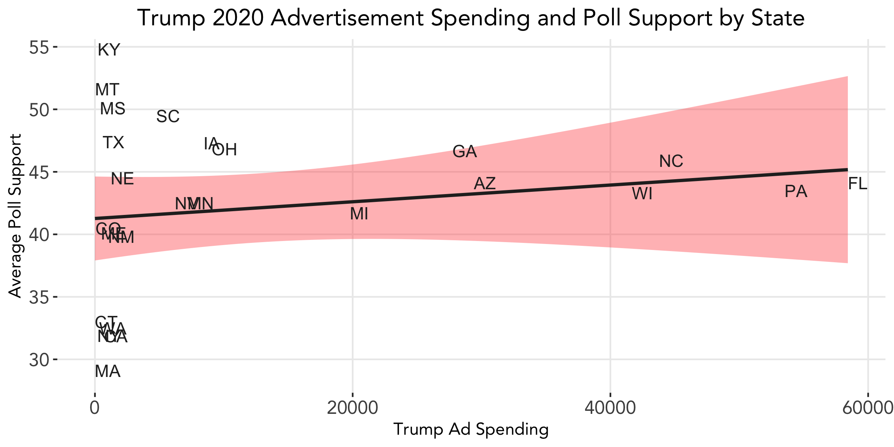

# The Air War: Advertising
### October 12, 2020

From the invention of the television to the creation of the World Wide Web to today's ubiquity of social media, the reach and extent to which advertising influences our everyday lives has been constantly evolving over time. Likewise, as technology changes, so too does the role of advertising in elections. Because complete data is difficult to obtain across advertising platforms and states, and the effects of advertising are extremely difficult to isolate from other factors, this week we will not update our predictive model but rather focus on some interesting descriptive statistics.

### The Effects of Advertising on the 2012 Election Outcome

A number of insightful studies have looked into the effects of advertising on voters. One such study by [Huber and Arceneaux](https://www.jstor.org/stable/4620110?seq=1) finds that presidential advertisements **do not increase mobilization or help to inform constituents**, but they do help to **persuade voters to favor a candidate**.

We test whether Huber and Arceneaux's findings hold for the most recent election cycle in our advertising dataset — the 2012 election between Obama and Romney — using a rough proxy: money spent on advertisement. Given advertisement spending by each candidate in the 2012 election, we subset the data by advertising money spent in each state and link that to the share of the popular vote received by each candidate in that state. We include the 34 states in which we have spendingd data for both the Obama and Romney campaigns, i.e. total cost of advertisements is greater than zero.

We then fit a simple linear regression model to the data. Below plots each candidate's spending by state and the vote share received in that state.

  
 
 

From the linear regression models, the estimated vote share for Obama with no advertisement spending is 53.1%, and for Romney 46.6%. In other words, with no advertisements, Obama is predicted to win an average of about 53% of the vote in each state. This may reflect a degree of the incumbency advantage we studied last week, since Obama was the sitting president during the 2012 election cycle.

We see some odd relationships in the graphs: by the fitted linear models, Obama's vote share is projected to decrease slightly as more money is spent on advertising in a state, whereas Romney's vote share is projected to increase slightly as more money is spent on advertising. However, these effects of advertisement spending on vote share is extremely small for both candidates.

There are a number of plausible explanations for why our data does not exhibit the increased support we would expect to see from advertisement spending:
* A candidate may spend more money in an area in which they have *less* support; in other words, a candidate may be more likely to run a commercial where he is trailing in the polls.
* We are missing data from 16 states; perhaps the states included in the model are unrepresentative of the nation as a whole, or more states favoring Romney over Obama are present.
* Again, the effects of advertising are hard to isolate and thus a number of other factors may be at play.

### The Effects of Advertising on the 2020 Election Outcome

Let's see if this year's election shows different outcomes. We look at aggregated state-level data for advertisement airing counts...

Polling averages are based on polls rated as A+, A, A-, A/B, B+, B, or B- by FiveThirtyEight and conducted with end date April 9, 2020 (to match the start date of the advertisement spending aggregate data), or later. In total, there are 30 states with polling data that were present in the dataset and meet these criteria, and of these 30 states, we have x states that also have advertisement spending data avilable.

  
 
 

This analysis could be improved if costs, and not just counts, were available. In addition,

