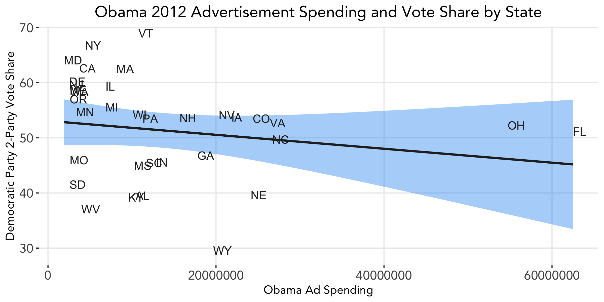
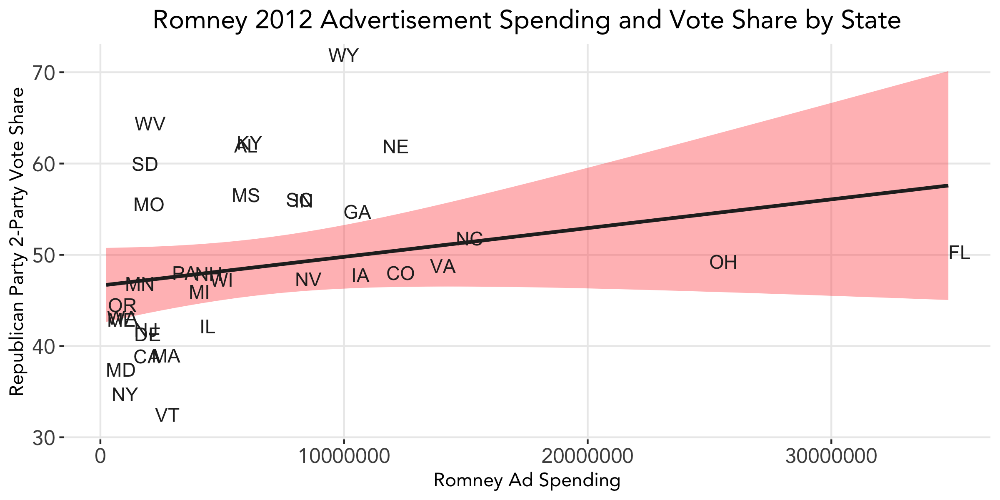

# The Air War: Advertising
### October 12, 2020

From the invention of the television to the creation of the World Wide Web to today's ubiquity of social media, the reach and extent to which advertising influences our everyday lives has been constantly evolving over time. Likewise, as technology changes, so too does the role of advertising in elections. Because complete data is difficult to obtain across advertising platforms and states, and the effects of advertising are extremely difficult to isolate from other factors, this week we will not update our predictive model but rather focus on some interesting descriptive statistics.

### The Effects of Advertising on the 2012 Election Outcome

A number of insightful studies have looked into the effects of advertising on voters: Gerber et al. find that the **durability** of effects of TV advertisements on voters diminishes extremely quickly.

In addition, Huber and Arceneaux affirm that presidential advertisements **do not increase mobilization or help to inform constituents**, but they do help to **persuade voters to favor a candidate**.

We test whether Huber and Arceneaux's findings hold for the most recent election cycle in our advertising dataset: the 2012 election between Obama and Romney. Given advertisement spending by each candidate in the 2012 election, we subset the data by advertising money spent in each state and link that to the share of the popular vote received by each candidate in that state. We include the 34 states in which we have spendingd data for both the Obama and Romney campaigns, i.e. total cost of advertisements is greater than zero.

We then fit a simple linear regression model to the data. Below plots each candidate's spending by state and the vote share received in that state.

  
 
 

From the linear regression models, the estimated vote share for Obama with no advertisement spending is 53.1%, and for Romney 46.6%. This may reflect the incumbency advantage in that...
However, from the graphs we see that...

There are a number of plausible explanations for why our data does not exhibit increased support based on ads:
* A candidate may spend more money in an area in which they have *less* support; in other words, a candidate may be more likely to run a commercial where he is trailing in the polls.
* ...
* Again, the effects of advertising are hard to isolate and thus a number of other factors may be at play.

### Social Media in the 2020 Election

