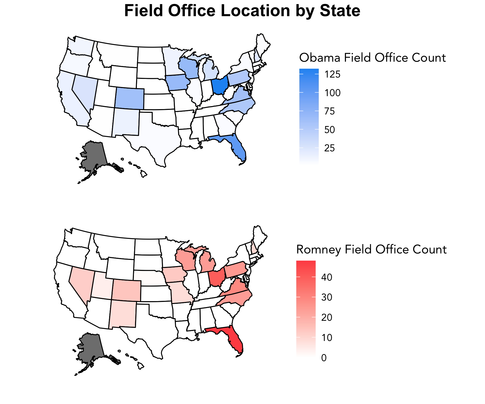
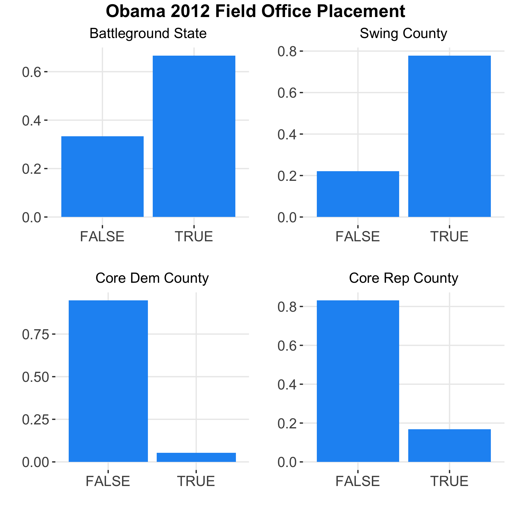
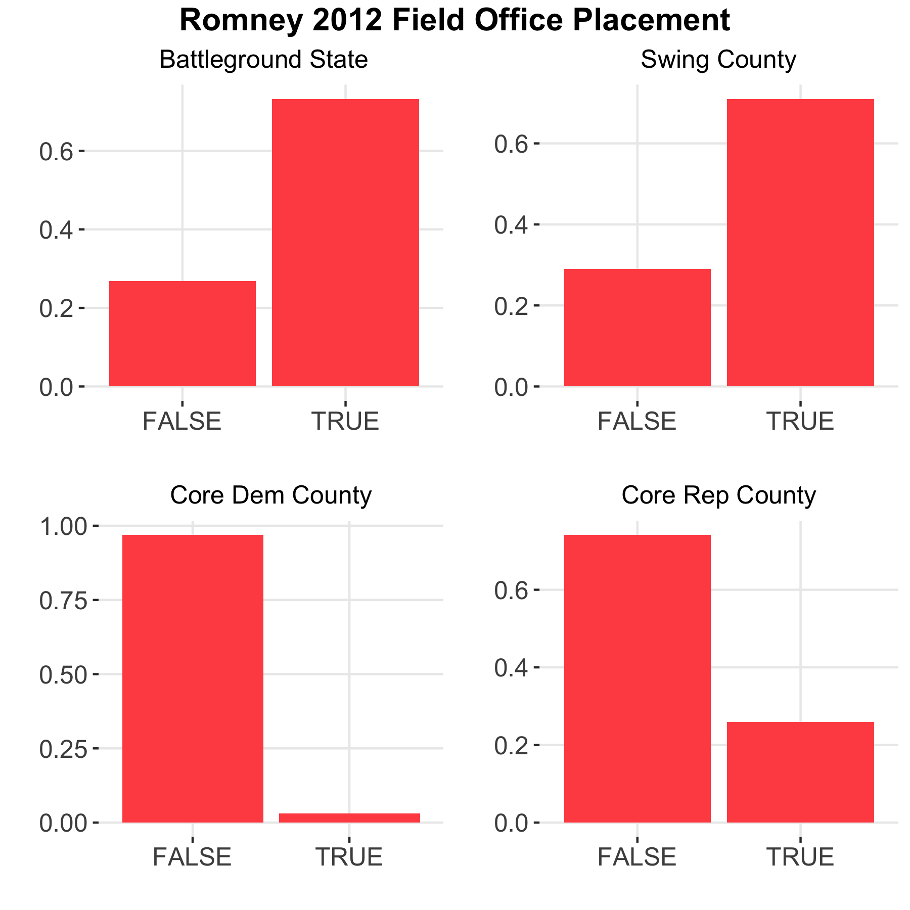

# The Ground Game
### October 19, 2020

Even as the Air War becomes increasingly important to elections, on-the-ground contact with constituents still remains an essential component to campaigning. The Ground Game proves to be a potentially more effective method in persuading and mobilizing voters, with messages and interactions being more personalized and targetted in comparison to mass media efforts – but this also makes ground efforts more costly and difficult to carry out. This week we continue our descriptive analysis to determine strategies in field office locations and consider what the Ground Game looks like in the current political climate.

### Where do campaigns place field offices?

Let's explore the 2012 presidential election between Barack Obama and Mitt Romney. We use county level data on field office locations for both candidates, with data available for all states minus Alaska. Battleground states are identified, and counties are classified as either core Democratic, core Republican, or swing based on historical voting patterns.

First, we aggregate field offices by state:
 
 

 
 
We can see some interesting trends:
* **Obama far outperformed Romney on the ground in terms of absolute numbers**, with 790 field offices compared to 283 respectively.
* In general, it appears that both Obama and Romney focused on major battleground states, particularly **Florida** and **Ohio**. Other targetted states by both campaigns include Colorado, Iowa, Michigan, North Carolina, Pennsylvania, Virginia, and Wisconsin, 5 of which are classified as battleground states.
* The Obama campaign had **at least 1 office in all 49 states** present in the data, whereas the Romney campaign was only represented in 15 distinct states.

We can dive deeper to a more granular level to better determine if any trends emerge in the campaign strategies of field office placement. Below are figures for each of the campaigns of the proportions of field offices placed in battleground states, swing counties, and core party counties.
 
 

 
 

 
 
**Both the Obama and Romney campaigns built more field offices in battleground states than core states**, As we saw in the map above, and, in addition, **both campaigns focused on swing counties within states**, indicating that field offices were placed with the goals of both persuading and mobilizing voters. [Enos and Fowler](https://www.cambridge.org/core/journals/political-science-research-and-methods/article/aggregate-effects-of-largescale-campaigns-on-voter-turnout/20C500B0DE62227873FD24CB3555F779) do find that on-the-ground contacts have significant cumulative effects on increasing voter turnout, which is an interesting contrast to our discovery last week that the air war had little to no effects on voter mobilization.

Comparing the core county data, it appears that the Obama campaign did devote some attention to **matching Romney's field offices**, as can be seen by the small proportion of field offices in core Republican counties. The Romney campaign did not reciprocate this move, however, as can be seen by the extremely low proportion of field offices placed in core Democratic counties.

We can use popular vote share by state data to roughly estimate if sheer numbers in field office counts have an effect on support. Running a simple linear regression of field office counts by state on two-party popular vote share by state, we determine that for every field office built, Obama experienced an *increase* in 0.04 percentage points whereas Romney experienced a *decrease* in 0.06 percentage points. Again, this is accounting for field office counts alone and is only a rough proxy for the effects of field offices.

### The Ground Game in 2020

The role of the Ground Game in influencing campaigns has the potential to grow as more sophisticated methods of data collection and analysis, and thus voter individualization, become possible. However, this year the COVID-19 pandemic has especially disrupted on-the-ground interactions, and the Biden and Trump campaigns have each responded differently. Trump has been [notorious](https://www.google.com/url?sa=t&rct=j&q=&esrc=s&source=web&cd=&ved=2ahUKEwjWg46KhsHsAhXmYd8KHYM6C2oQFjAAegQIBRAC&url=https%3A%2F%2Fwww.washingtonpost.com%2Fpolitics%2Ftrump-returns-to-public-campaigning-falsely-claiming-that-the-virus-that-infected-him-is-disappearing%2F2020%2F10%2F10%2F381002c2-0b37-11eb-9be6-cf25fb429f1a_story.html&usg=AOvVaw2V3AlXq335gLJ6kcMt4PTk) about ignoring cautionary measures to transmitting the virus by continuing to hold large, in-person rallies, even after he was infected himself; the Biden campaign, on the other hand, has largely [limited its on-the-ground efforts](https://www.vox.com/21366036/canvass-ground-game-turnout-gotv-phone-bank-tv-ads-mailers) for most of the lead-up to the election. Nevertheless, with 15 days to go, we see [both candidates heavily campaigning](https://www.nytimes.com/live/2020/10/18/us/trump-vs-biden), vying for those last supporters that could determine the election outcome.
