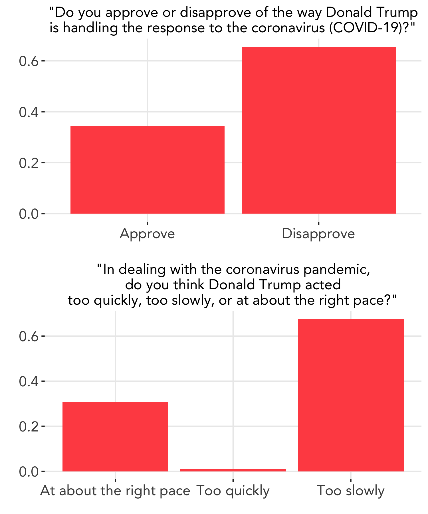
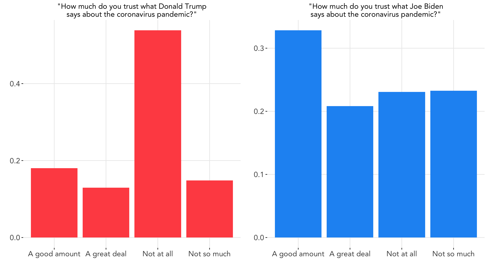
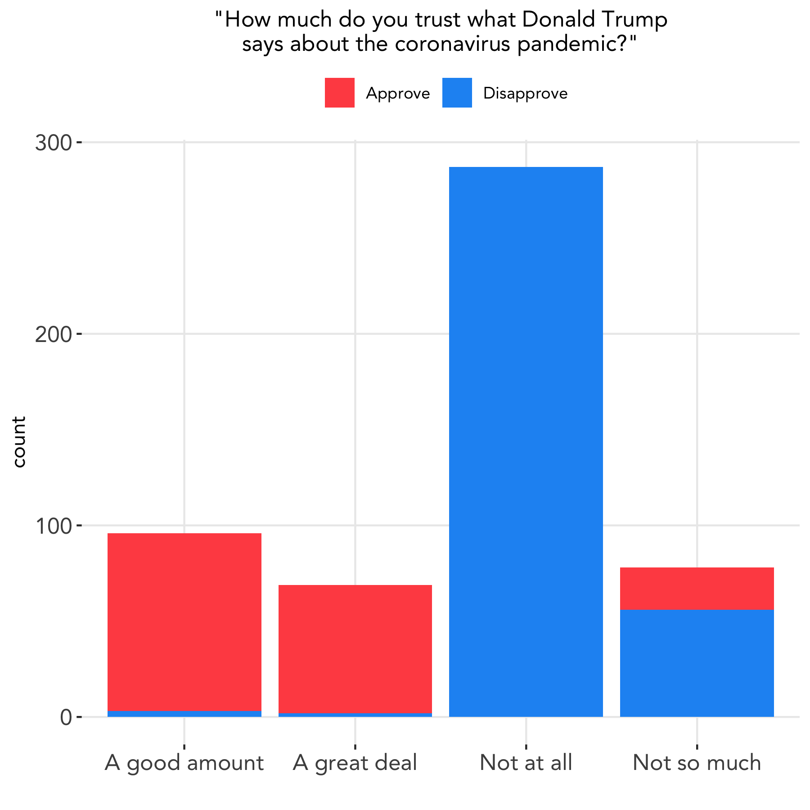
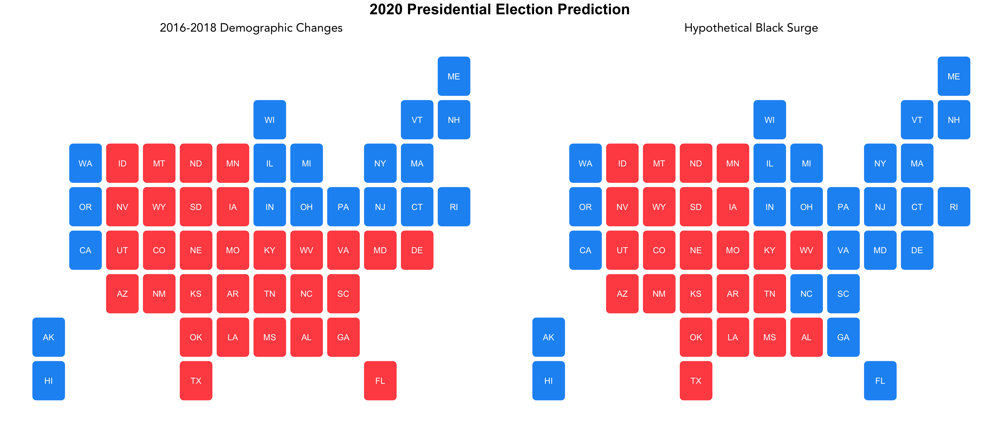

# Shocks: COVID-19 and Social Movements
### October 26, 2020

Can shocks, defined as any unexpected or unpredictable events, influence an election's outcome? This question has been studied by scholars in many different contexts, including shark attacks ([Achen and Bartels 2017](https://www.jstor.org/stable/j.ctvc7770q)), war casualties ([Karol and Miguel 2007](http://emiguel.econ.berkeley.edu/assets/miguel_research/33/_Paper__Electoral_Cost_of_War.pdf)), and sports game results ([Healy et al. 2010](https://www.pnas.org/content/107/29/12804.abstract)). Though the causal effects of shocks are difficult to isolate, findings point again to the theory of retroactive voting: that voters do tend to either reward or punish incumbents based on past events. Thus it is plausible that shocks, even ones seemingly apolitical, can alter voters' behaviors. We explore shocks that may affect the 2020 presidential election, including the COVID-19 pandemic and racial justice movements of magnitude unique to this year.

### A Look Into COVID-19 Polling Data

Although the occurrence of natural disasters is outside of the president's control, the president can control his response to the natural disaster, of which [Healy et al. 2010](https://www.pnas.org/content/107/29/12804.abstract) found can have substantial effects on election outcomes. Their findings may be applicable to the current climate of COVID-19.

Using [polling data](https://ropercenter.cornell.edu/supporting-public-opinion-data-related-covid-19?utm_source=Data+Dive+from+Roper%40Cornell+6.28.18&utm_campaign=28df841335-EMAIL_CAMPAIGN_2019_10_08_04_38_COPY_02&utm_medium=email&utm_term=0_b24149c0c3-28df841335-&utm_source=Data+Dive+from+Roper%40Cornell+6.28.18&utm_campaign=28df841335-EMAIL_CAMPAIGN_2019_10_08_04_38_COPY_02&utm_medium=email&utm_term=0_b24149c0c3-28df841335-580634065), we can look at where public opinion stands regarding the pandemic. Survey responses were collected September 11–12, 2020, and respondents consist of a nationally representative sample.

Below is the distribution of responses to two questions concerning Trump's response to the pandemic.
 
 

 
 
**Nearly two-thirds of respondents expressed disapproval of Trump's response to COVID-19**, and **over two-thirds of respondents believed he acted too slowly**. Nearly all respondents who answered "at about the right pace" expressed approval of Trump's response.

Below is the distribution of responses to two questions comparing trustworthiness of the two presidential candidates.
 
 

 
 
We can see that **a slight majority of respondents do not trust what Trump says about the pandemic at all**, whereas feelings towards Biden are more mixed. It may be more difficult for people to form an opinion about Biden's trustworthiness, since he does not currently hold political office and does not wield the power that Trump possesses in responding to the pandemic. In addition, people are likely to seek out information regarding COVID-19 from sources other than political candidiates. Nevertheless, this response distribution may provide insight into how constituents view the two candidates's trustworthiness not only regarding the pandemic but also other issues as well.

We can further break down the question, "How much do you trust what Donald Trump says about the coronavirus pandemic?" into responses from the first question, and we see that those who expressed disapproval towards Trump's handling of the pandemic are much more likely to rate his trustworthiness low, and vice versa.
 
 

 
 
Given that COVID-19 has transformed our lives and resulted in hundreds of thousands of deaths nationwide, it is probable that this shock may have an impact on this year's election. A recent [study](https://www.nytimes.com/2020/07/28/upshot/polling-trump-virus-election.html) in *The New York Times* has found that as deaths due to COVID-19 go up in a given area, their support for Trump goes down. We will take this into account in our final prediction model next week.

### Another Potential Shock: Social Movements

With the killings of innocent lives and the reckoning with societal injustices of which COVID-19 has only exacerbated, we have seen a call to action [larger than any other in history](https://www.nytimes.com/interactive/2020/07/03/us/george-floyd-protests-crowd-size.html). People are demanding leaders take action with urgency, and thus this year's election may see an increased mobilization of certain demographic groups. We can model the potential effects of these surges by taking into account historical patterns of voting of demographic groups.

Consider a hypothetical situation in which the effect of the Black bloc growth on the Democratic vote increases by 20% due to increased mobilization and turnout. We can use a simple linear regression model with adjusted coefficients to account for this hypothetical surge. Below, the map on the left shows the results of the estimated coefficients using demographic changes from 2016 to 2018, whereas the map on the right uses an adjusted coefficient presenting a 20% Black bloc surge.

In the first scenario, **Biden is predicted to win 255 electoral votes and Trump to win 283**, whereas with the hypothetical surge, the states of Delaware, Florida, Georgia, Maryland, North Carolina, South Carolina, and Virginia are predicted to switch from a Trump win to a Biden win, thus giving **Biden a predicted 350 electoral votes and Trump with 188**. Thus, the hypothetical surge in Black voters changes the outcome of the election.

We have reason to believe that surges such as the one modeled above may affect the election outcome this year. Anecdotally, in some states such as North Carolina, [Black voters have already turned out](https://www.citizen-times.com/story/news/2020/10/20/nc-black-voter-turnout-up-2020-biden-and-trump-court-key-group/5981602002/) in higher numbers than in 2016. And nationally, [Gallup](https://news.gallup.com/poll/321599/voter-turnout-appears-steady-enthusiasm-running-high.aspx) has found that voters are more enthusiastic than the past four elections, which may result in increased turnout. If turnout numbers remain on par with [record early voting numbers](https://www.theatlantic.com/politics/archive/2020/10/2020-election-turnout/616640/) and assuming no large issues arise, then we may see the largest voter turnout in recent elections.
