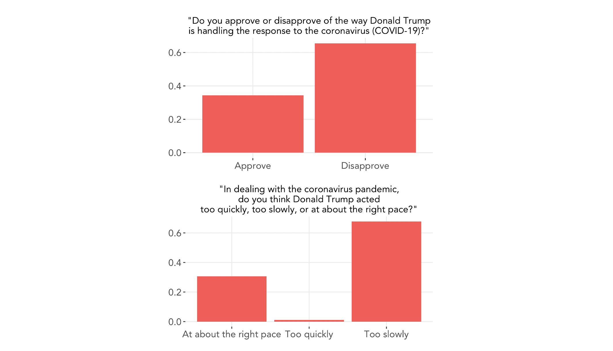

# Shocks: COVID-19
### October 26, 2020

Can shocks, defined as any unexpected or unpredictable events, influence an election's outcome? This question has been studied by scholars in many different contexts, including shark attacks ([Achen and Bartels 2017](https://www.jstor.org/stable/j.ctvc7770q)), war causalties ([Karol and Miguel 2007](http://emiguel.econ.berkeley.edu/assets/miguel_research/33/_Paper__Electoral_Cost_of_War.pdf)), and sports game results ([Healy et al. 2010](https://www.pnas.org/content/107/29/12804.abstract)). Though the causal effects of shocks are difficult to isolate, we return to the theory of retroactive voting, noting that voters do tend to eithe reward or punish incumbents based on events in their term. Thus it is plausible that shocks, even ones seemingly apolitical, can alter some voters' behaviors. We explore shocks that may affect the 2020 presidential election, including the repercussions of the COVID-19 pandemic and social movements of magnitude and reach unique to this year.

### A Look Into COVID-19 Polling Data

Although the occurrence of natural disasters is outside of the president's control, the president can control his response to the natural disaster, of which [Healy et al. 2010](https://www.pnas.org/content/107/29/12804.abstract) found can have substantial effects on election outcomes. Their findings may be applicable to the current climate of COVID-19.

Using [polling data](https://ropercenter.cornell.edu/supporting-public-opinion-data-related-covid-19?utm_source=Data+Dive+from+Roper%40Cornell+6.28.18&utm_campaign=28df841335-EMAIL_CAMPAIGN_2019_10_08_04_38_COPY_02&utm_medium=email&utm_term=0_b24149c0c3-28df841335-&utm_source=Data+Dive+from+Roper%40Cornell+6.28.18&utm_campaign=28df841335-EMAIL_CAMPAIGN_2019_10_08_04_38_COPY_02&utm_medium=email&utm_term=0_b24149c0c3-28df841335-580634065), we can look at where public opinion stands regarding the pandemic. Survey responses were collected September 11–12, 2020, and respondents consist a nationally representative sample.

Below is the distribution of responses to two questions concerning Trump's response to the pandemic.
 
 

 
 
**Almost two-thirds of respondents expressed disapproval of Trump's response to COVID-19**, and **over two-thirds of respondents believed he acted too slowly**. Nearly all respondents who answered "at about the right pace" expressed approval of Trump's response.

Below is the distribution of responses to two questions comparing trustworthiness of the two presidential candidates.
 
 

 
 
We can see that **a slight majority of respondents do not trust what Trump says about the pandemic at all**, whereas feelings towards Biden are more mixed. It may be more difficult for people to form an opinion about Biden's trustworthiness, since he does not currently hold political office and thus wields no substantial power to respond to the pandemic. In addition, people are likely to seek out information regarding COVID-19 from sources other than political candidiates.

We can further break down the question, "How much do you trust what Donald Trump says about the coronavirus pandemic?" into responses from the first question, and we see that those who expressed disapproval towards Trump's handling of the pandemic are much more likely to rate his trustworthiness low, and vice versa.
 
 

 
 
Given that COVID-19 has transformed our lives and resulted in hundreds of thousands of deaths nationwide, it is probable that this shock may have an impact on this year's election. A recent [study](https://www.nytimes.com/2020/07/28/upshot/polling-trump-virus-election.html) in *The New York Times* has found that as deaths due to COVID-19 go up in a given area, their support for Trump goes down. We will take this into account in our final prediction model next week.

### Another Shock: Social Movements

With the killings of innocent lives and the reckoning with societal injustices of which COVID-19 has only exacerbated, we have seen a call to action larger than any other in recent history. People are demanding leaders take action with urgency, and thus this year's election may see an increased mobilization of certain demographic groups.

We can model the potential effects of these surges by considering historical patterns of voting of demographic groups.

Consider a hypothetical situation in which the effect of Black bloc growth on the Democratic vote increases by 20% due to increased mobilization and turnout. We can use this surge model as a rough proxy for such a situation. Below is the result of increasing the effect:

With the hypothetical surge, the states of Virginia, Maryland, Delaware, North Carolina, South Carolina, George, and Florida are predicted to switch from red to blue. In the first scenario, Biden is predicted to win 255 electoral votes and Trump to win 283, whereas in the second scenario, Biden is predicted to win 350 and Trump with 188. Thus, the hypothetical surge in Black voters changes the outcome of the election.

We have reason to believe that surges may affect the election outcome this year. Voter turnout numbers have already exceeded historical numbers. Anecdotally, in some states such as North Carolina, [Black voters have turned out](https://www.citizen-times.com/story/news/2020/10/20/nc-black-voter-turnout-up-2020-biden-and-trump-court-key-group/5981602002/) at higher numbers in particular.

America's [minority](https://www.axios.com/demographic-shifts-what-matters-2020-424161bf-1e6e-4da9-b2b2-9a6b2b2099fa.html) is growing and trending to exceed.... [Gallup](https://news.gallup.com/poll/321599/voter-turnout-appears-steady-enthusiasm-running-high.aspx) has found that voters are turning out at higher rates this year, and more than [xx million votes have already been cast](https://electproject.github.io/Early-Vote-2020G/index.html), making voter turnout rates much higher than in 2016. [Another source](https://www.theatlantic.com/politics/archive/2020/10/2020-election-turnout/616640/).

___

Despite the far-reaching and dramatic effects that COVID-19 has had on society, the effects of even this shock on influencing voters' views of the presidential candidates may be relatively low due to political polarization and the strength of partisanship in our present political climate. What may have an influence on the election outcome, however, is the effects of COVID-19 on **voter registration and turnout**. 

Let’s model the potential fluctuation in turnout due to COVID. In Week 3, we used a linear regression model fitted to each state to predict voter support for the incumbent party based on polling numbers. However, as we saw, doing so sometimes led to predicted vote shares below 0 or above 100 — impossible outcomes. A solution to account for the natural boundaries of vote share is to use a binomial logistic regression model instead. This model takes into account the size of the **voting-eligible population (VEP)** and models each voter as either voting or not voting for the candidate.

Here are the three datasets we are joining:
* Popular vote share by county for election years from 2000 to 2016
* COVID death counts February 1, 2020, to October 17, 2020, per the [CDC](https://data.cdc.gov/NCHS/Provisional-COVID-19-Death-Counts-in-the-United-St/kn79-hsxy)
* Demographic data by county from 1990 to 2018
We can match state and FIPS codes to join the data together.
