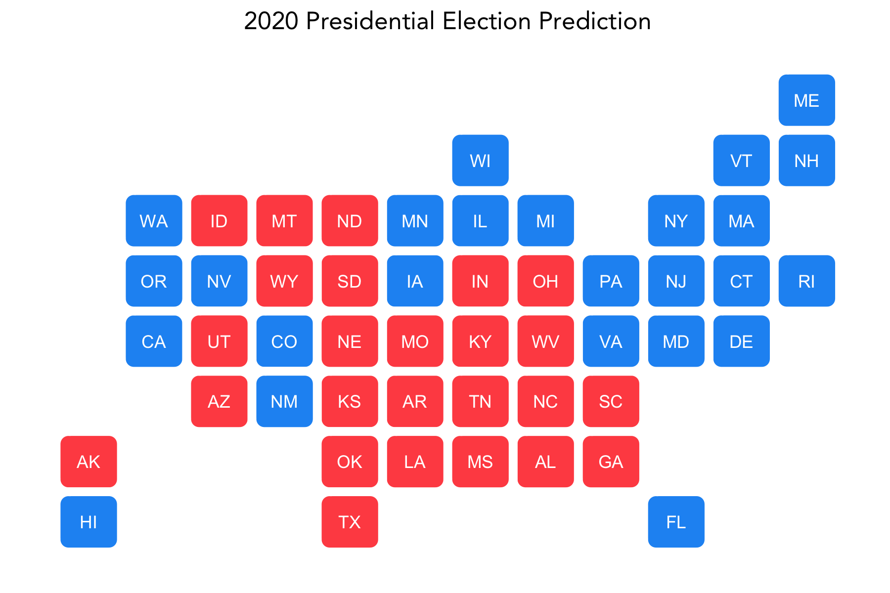
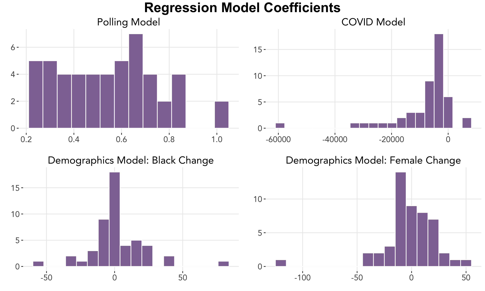

# Final Prediction
### November 1, 2020

Using everything we have learned and explored these past seven weeks, we present our final prediction for the 2020 U.S. presidential election.

### Prediction Model

To predict the election outcome, we use a **weighted ensemble** of **linear regression models**, fitted to the following sets of data:
* Polling data from election years 1948 to 2020, by state
* COVID-19 deaths, from February 27 to October 27, by state
* Demographic data 1990 to 2018, by state

In other words, our model predicts that the **incumbent party vote share is based on popular support, deaths due to COVID-19, and demographic changes**.

For each state, we run three different linear regression models as follows:

where
* Incumbent Vote = incumbent party 2-party vote share
* Average Poll Support = average support from polls in a given state and a given year (1972–2016)
* COVID-19 Deaths = total deaths due to COVID-19 in a given state up to a given date (02/27/20 to 10/27/20)
* Black Change = change in black population between consecutive election years (1976–2016) in a given state
* Female Change = change in female population between consecutive election years (1976–2016) in a given state

We then construct our final ensemble by adding the results from each of the models above with the following weights:
 
 

 
 

Here is our final prediction for the 2020 election, with blue representing a Biden win and red a Trump win:
 
 

 
 
Under this model, **Trump is predicted to garner 224 votes, but Biden is predicted take the win with 314 electoral votes**.

The following shows the associated 95% confidence intervals for each state's prediction.

### Why This Model
Let's look at the three main variables included in our model.

#### Poll Support
Abramowitz, maker of the famous time-for-change model, includes only the net approval rating of the president in his prediction model for this year. I choose to follow a similar method of prediction, creating a simple linear regression model on polling data with a hypothetical surge. Then, I adjust the state predictions with localized COVID-19 death counts.

#### COVID Deaths
My reasoning for including the COVID-19 death counts is to slightly account for the finding of Vavreck and Warsaw that more COVID deaths result in a drop in Trump support. In addition, the country is now entering its third wave of the COVID-19 pandemic, and I want to account for this unfortunate but real rise in cases (and deaths).

#### Demographic Changes
My assumptions for the surge numbers is that (1) social movements have inspired more Black voters to vote and (2) Latino population growth will result in a surge (FiveThirtyEight podcast).
https://fivethirtyeight.com/features/politics-podcast-national-and-district-level-polls-disagree-about-how-close-the-2020-election-is/
https://www.axios.com/demographic-shifts-what-matters-2020-424161bf-1e6e-4da9-b2b2-9a6b2b2099fa.html

(3) women, and in particular suburban women, are predicted to turnout at higher rates for Democrats (NYTimes podcast)
	- Both women who voted for Trump in 2016 and women who didn't vote in 2016
	- "white suburban women have become more progressive on issues of race"
George Floyd calling out to moms

#### What's *Not* In This Model
What about all of the other factors we've looked at over these past few weeks? It is important to address what is *not* included in our model:
*

#### Coefficients and weights

#### Interpretation of coefficients and/or justification of weights

### Model Validation

### Uncertainty

#### Sensitivity Analysis

It is important to acknowledge that the weights selected for our ensemble model, although based on careful reasoning, may seem somewhat arbitrary. We can look at how much the final results change as we adjust the weights.

