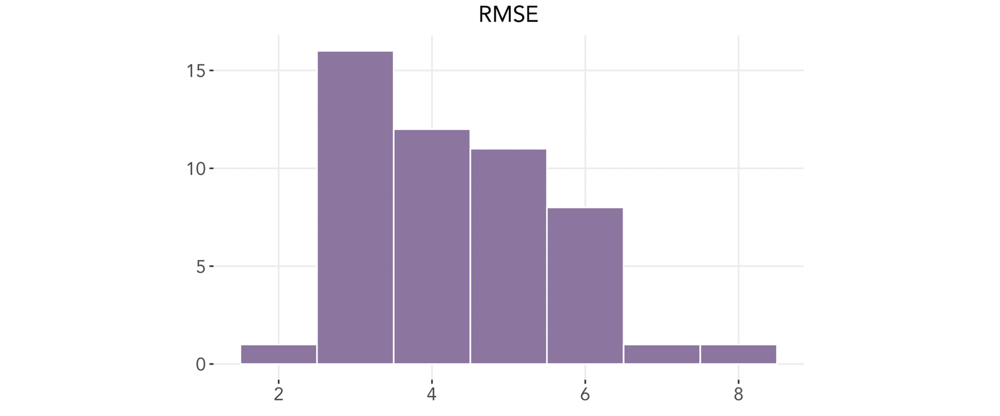

# Final Prediction
### November 1, 2020

Using everything we have learned and explored these past seven weeks, we present our final prediction for the 2020 U.S. presidential election.

## Prediction Model

To predict the election outcome, we use a **weighted ensemble** of **linear regression models**, fitted to the following sets of data:
* Polling data from election years 1948 to 2020, by state
* COVID-19 deaths, from February 27 to October 27, by state
* Demographic data 1990 to 2018, by state

In other words, our model predicts that the **incumbent party vote share is based on popular support, deaths due to COVID-19, and demographic changes**.

For each state, we run three different linear regression models as follows:
 

 
where
* Incumbent Vote = incumbent party 2-party vote share
* Average Poll Support = average support from polls in a given state and a given year (1972–2016)
* COVID-19 Deaths = total deaths due to COVID-19 in a given state up to a given date (02/27/20 to 10/27/20)
* Black Change = change in black population between consecutive election years (1976–2016) in a given state
* Female Change = change in female population between consecutive election years (1976–2016) in a given state

We then construct our final ensemble by adding the results from each of the models above with the following weights (for explanation of choice of weights, see further below):
 
 

 
 

Here is our final prediction for the 2020 election, with blue representing a Biden win and red a Trump win:
 
 

 
 
### Under this model, Biden is predicted to win with 314 electoral votes and Trump to lose at 224 votes.

The following shows the 95% confidence intervals for each state's prediction.
 
 

 
 
A few notable states predicted to flip from red in 2016 to blue this year are **Florida, Iowa, Michigan, Pennsylvania, and Wisconsin**. Battleground states predicted to stay the same are **Arizona, North Carolina, Ohio, and Texas**. Nevertheless, for all of these states, the predicted vote share is within one or two percentage points of 50%, and the span of their confidence intervals indicate that ultimately the win could go to either side.

## Why This Model
Let's consider why we choose to include each of the variables in our model:
* **Polling support**: Polling data has been shown to have substantial predictive power on previous elections. Notably, Alan Abramowitz, creator of the famous [time-for-change model](https://www.cambridge.org/core/journals/ps-political-science-and-politics/article/will-time-for-change-mean-time-for-trump/6DC38DD5F6346385A7C72C15EA08CA09/share/f8ca1223dd58ec9ae27b68154beb52ec9c320cd8), is including only the net approval rating of the president in his prediction model for this year.
* **COVID deaths**: New findings from [Warshaw et al.](https://advances.sciencemag.org/content/6/44/eabd8564) reveal that deaths due to COVID-19 tend to decrease localized support for Trump, in addition to other Republican candidates. Given the recent spikes in COVID cases across the nation, we have reason to believe that polls alone may not fully capture the effects that Warshaw et al. point to.
* **Demographic changes**: Our demographic model accounts for changes in both the Black demographic bloc and the female bloc. We predict that the widespread Black Lives Matter movement ignited by the killings of George Floyd and many others and the reckoning with social injustices will spur more Black voters to [turn out](https://www.citizen-times.com/story/news/2020/10/20/nc-black-voter-turnout-up-2020-biden-and-trump-court-key-group/5981602002/), as discussed in last week's [blog post](https://ahu6.github.io/electionanalytics/posts/10_26.html). Furthermore, the [*New York Times*](https://www.nytimes.com/2020/10/26/podcasts/the-daily/suburban-women-trump-biden-election.html) reports that women, and suburban women in particular, are predicted to turn out at higher rates for Democrats this year, including women who voted for Trump in 2016 and women who didn't vote in 2016.
Given the relatively large predictive power of polling data, we give the largest weight to the model based on polling data and past election results. We give the remaining weight equally to each of the COVID model and the demographic model. This gives substantial weight to both yet gives three times more weight to the polling data, as desired.

We can look at the magnitude and direction of the effects of each of the above variables on the outcome in a given state. Running each of the three linear regression models on each state's data produces the following distribution of coefficients:
 
 

 
 
Each of the coefficients can be interpreted as follows:
* Polling model: the change in incumbent party vote share for one percentage point increase in average polling support
* COVID model: the change in incumbent party vote share for one additional COVID-19 death per capita
* Demographics model, Black change: the change in incumbent party vote share for one percentage point increase in Black population, holding female change constant
* Demographics model, female change: the change in incumbent party vote share for one percentage point increase in female population, holding Black change constant
As expected, increases in average polling support leads to an increase in incumbent party vote share. For the COVID model, we can see that for most states, an increase in COVID deaths result in a decrease in support for the incumbent party candidate, as Warshaw et al. found. For the demographics model, growth in the Black demographic bloc has mixed effects on the incumbent party vote share but may lead to a decrease in support in some states. Female change follows a similar pattern, tending to decrease support but also increasing in some states. 

A measure of how well the models predict past election results are their **root mean squared errors** (RMSEs). Below shows the distributions of the weighted RMSEs for each state:
 
 

 
 
Most RMSEs fall within the 3 to 6 range with a mean of 4.3. This shows that the model performs relatively consistently across states.

## What's *Not* In This Model
What about all of the other factors we've looked at over these past few weeks? It is important to address what is *not* included in our model. We claim that the effects of the following factors ultimately have little effect, or cancel out with each other, on this year's election.
* Regarding **economic fundamentals**, it has been shown that the effect of economic indicators have diminishing effects as the election draws nearer. The weighted ensemble presented in the [Polling](https://ahu6.github.io/electionanalytics/posts/09_28.html) week uses this assumption, per [FiveThirtyEight](https://projects.fivethirtyeight.com/2020-election-forecast/)'s method, that on Election Day the effects go to 0. In addition, given the pandemic this year, the economy has reach lows it has never experienced before, and thus the numbers may not hold much predictive power using historical data.
* Abramowitz also discusses the **incumbency** factor relating to this election; we have reason to believe that Trump will not enjoy much of an incumbency advantage, if any, this year due to the drastic effects that COVID-19 has had on people's lives, among other factors.
* As explored in the [Air War](https://ahu6.github.io/electionanalytics/posts/10_12.html) week, relative spending on **advertisements** do not seem to have significant effects on presidential election outcomes (although they may on down-ballot races).
* Finaly, increasing **political polarization** within the electorate has diminished the effects of many, if not most, factors.

## Alternate Outcomes
It is important to acknowledge that the weights selected for our ensemble model, although based on reasoning, may seem somewhat arbitrary. We can conduct a sensitivity test, or look at how much the final results change as we adjust the weights. We try increasing the weight of the poll model by 0.1 until we reach 1 (which creates a prediction solely based on the polling model) and allocating the remaining weight to the COVID and demographic models equally, as before.
 
 

 
 
We can see that the predicted electoral vote count for the incumbent party levels off at 269; in other words, our model predicts a Biden win regardless of the weights. In fact, the change from 0.9 to 1.0 for the weight of the polling model did not change the final electoral vote count. Although there are other combinations of ways to change the weights, this provides us with an approximate sensitivity analysis for our model.

## Final Notes
The art and science behind predicting election outcomes is difficult during a "normal" year, much less in this year of many unknowns. With the unprecedented numbers of people turning out to vote early this year and new levels of mail-in ballot counts, it is quite possible that factors like these may affect the speed in which a winner can be determined or even the election outcome. Only time will tell...let the countdown begin!
