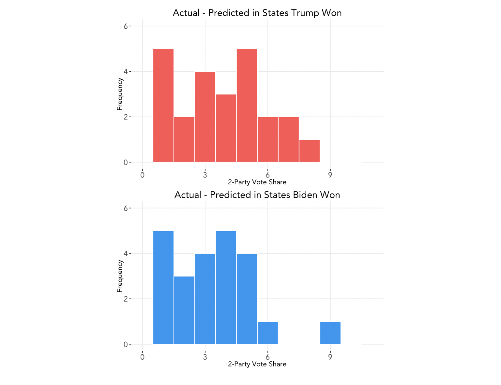

# Post-Election Reflection
### November 23, 2020

### Recap of Model and Predictions
 
 

 
 
I incorrectly predicted the outcomes for 4 states: Arizona, Georgia, Florida, and Iowa.

### Accuracy of Model

Overal RMSE: 4.35

Average percentage point difference of actual minus predicted for states Biden won: -2.49
Average percentage point difference of actual minus predicted for states Trump won: 3.72
* In general, overpredicted Biden vote share, underpredicted Trump.

 
 

 
 

### Inaccuracies
(Proposed hypotheses for why the model(s) were inaccurate in the estimates or locations where it was inaccurate. 
Why components of the model may not have been predictive or may not have been predictive in certain cases.)

(Proposed quantitative tests that could test these hypotheses, e.g., what data, if available, could allow you to test whether the reason proposed really did cause the inaccuracy in your model.  If there is no plausible test of the hypothesis, explain why.  You do not need to perform these tests or explain them in great detail (e.g., there is no need to write down an equation showing your exact test), just propose them.  )

### In the Future

(A description of how you might change your model if you were to do it again.)
