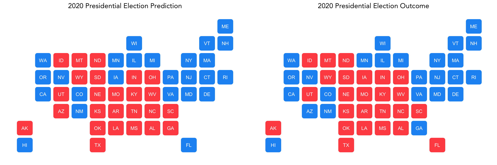
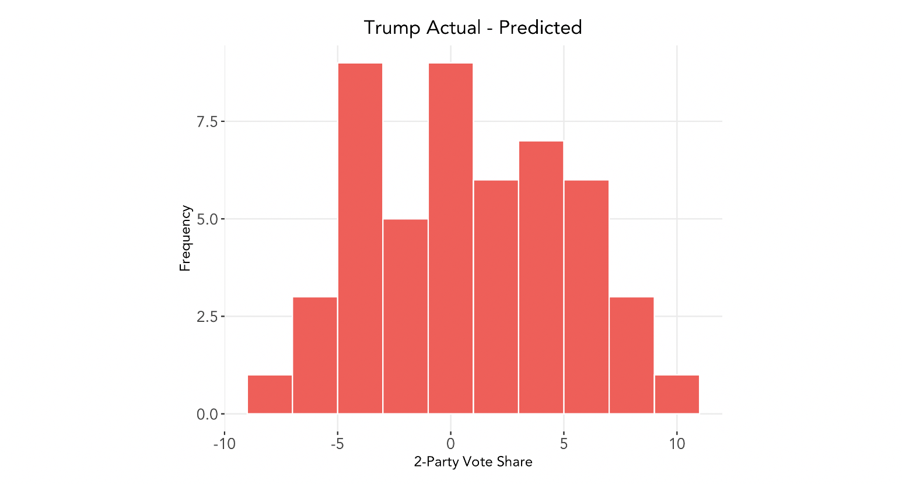

# Post-Election Reflection
### November 23, 2020

With the outcome of this year's much-anticipated election finally solidified and a new president-elect for the nation, we take a look at how our model performed.

## Recap of Model

To briefly recap our model, we created a weighted ensemble using three linear regression models based on polling data, COVID-19 deaths, and demographic data, as follows:
 

 
Then, we assigned the following weights to the models:
 
 

*(Full details of how we constructed our model can be found [here](https://ahu6.github.io/electionanalytics/posts/11_01.html).)*

Our model produced the following electoral vote count predictions:
* Biden: 314
* Trump: 224

Below is a plot of what our model predicted compared to what the true outcome was in each state, with blue representing a Biden win and red a Trump win:
 
 

 
 
The final electoral vote count was
* Biden: 306
* Trump: 232

Thus, **our predicted electoral vote count was off by 8 points and incorrectly predicted the outcomes for four states: Arizona, Georgia, Florida, and Iowa.**

## Accuracy of Model

Using the vote counts last updated on November 17, we can calculate our model's root mean square error (RMSE), a measure of how far our predicted values for each state are from their true values. The **RMSE of our model is 4.35**.

Below is the distribution of Trump's actual vote share minus our model's predicted vote share:
 
 

 
 
The error appears to be relatively evenly distributed, with a mean difference of 0.62 percentage points.

We can also segment this by the candidate who won each state. The average percentage point difference of the true two-party popular vote share from the predicted vote share for states Biden won is -2.49, whereas in states Trump won the average difference is 3.72. Below, we present the absolute difference between actual and predicted vote share to better compare the distributions:
 
 

 
 
We see that our model exhibits slightly larger errors for states in which Trump won. Taken together with the number above, we find that **in general, our model overpredicted Biden's vote share and underpredicted Trump's and was slightly more accurate for states in which Biden won**.

## Inaccuracies
What can explain the inaccuracies in our model, and in particular, the general tendency to overpredict for Biden and underpredict for Trump? Reflections from [*The New York Times*](https://www.nytimes.com/2020/11/10/podcasts/the-daily/election-polls-biden-trump.html?) and other sources may provide clues to potential explanators, which we consider separately below.

* Trump appears to have done well with **Latino voters**; growth in support from this demographic bloc was not included in our model. Even if we had included this bloc in our demographic model, however, recent historical trends show that, on average, Latinos favor Democrats; this year, the diverging voting patterns of Latinos in different parts of the country emphasize that Latinos [cannot just be viewed as a monolith](https://www.economist.com/united-states/2020/11/04/why-donald-trump-exceeded-expectations-with-americas-latinos), and support for Trump in Florid and Texas may indicate that Trump's campaign was able to effectively appeal to Latino voters moreso than in 2016 or than previous Republican presidential candidates. Polls also struggle to get enough representation from Latino voters, so the polling data included in our model may have missed this trend as well.

* **Black voters** turned out in large numbers, as assumed by our model, but turnout among *non-Black* voters [increased at an even greater rate](https://www.nytimes.com/2020/11/10/podcasts/the-daily/election-polls-biden-trump.html?). Trump was also able to [maintain his base among white voters](https://www.economist.com/graphic-detail/2020/11/11/once-again-less-educated-whites-spurned-americas-democratic-nominee) in a much stronger manner than the polls projected. Why the polls appeared to underestimate support for Trump, similar to 2016, may be a sign that current polling methods tend to overrepresent Democrats, or that Trump's supporters still make up a ["silent majority"](https://www.nytimes.com/2020/11/04/us/politics/poll-results.html?searchResultPosition=3). Nevertheless, as [FiveThirtyEight](https://fivethirtyeight.com/features/the-polls-werent-great-but-thats-pretty-normal/) points out, "polls have *always* come with a degree of uncertainty"; just because the polls showed bias in the same direction for two presidential elections in a row does not necessarily mean that their methodology is biased in this direction. Other factors, specifically the pandemic, may have affected polling numbers this year, too.

* Many scholars have pointed to the [pivotal role of **suburban voters**](https://www.nytimes.com/interactive/2020/11/06/upshot/suburbs-shifted-left-president.html) in this year's election, especially [white suburban women](https://www.brookings.edu/research/bidens-victory-came-from-the-suburbs/)'s shift from 2016. This could be a source of inaccuracy in our model because we did not have a direct proxy for urban vs. suburban vs. rural voter demographics. 

* We included the effects of **COVID-19** on voter support for the incumbent, namely that more COVID-19 deaths in an area [correlates with decreased support for Trump](https://advances.sciencemag.org/content/6/44/eabd8564). Again, however, that Trump maintained his base in a stronger manner than we (and the polls) predicted. Perhaps the effects of COVID-19 played a lesser role than our model accounted for; although the pandemic was on peoples' minds, it was [not enough to sway their vote](https://www.nytimes.com/2020/11/04/us/politics/poll-results.html?searchResultPosition=3).

* Our model did not use **economic indicators** on the basis that the pandemic created such dramatic changes in indicators such as GDP growth rate that including those would yield unrealistic predictions. It can be argued, however, the Trump, as the incumbent president, was still [given credit](https://www.nytimes.com/2020/11/10/podcasts/the-daily/election-polls-biden-trump.html?) for how he managed the economy pre-COVID. In addition, some voters may have viewed his stimulus package and push to reopen the economy as an effective handling of the nation.

### What if we had just used polling data, without adjusting for demographics and COVID-19 deaths?
Let's look at how accurate our model would have been if we just used a simple linear regression model of polling support, essentially weighting the demographic model and COVID-19 model to 0.

The overall RMSE is improved to 3.56; however, Trump's predicted electoral college vote count is 269, producing a larger electoral vote count error of 45. Below charts the difference between actual and predicted vote share for Trump under this new model:
 
 

 
 
It seems that although the COVID-19 and demographics data could have added more noise to our model, they added some predictive value overall.

### Other Potential Tests

To determine whether some of the hypotheses regarding inaccuracies outlined above hold true, if the data were available we could also perform the following tests:
* Include Latino voters in our linear regression model based on demographic data, and adjust weights to analyze how including Latino change affects predictions
* Compare the voting patterns of urban, suburban, and rural dwellersand either add a variable to our demographic change model or create a new regression model to account for this
* Create a regression model based on economic indicators and support for the incumbent to test if the economy did give Trump a boost

## In the Future

Considering the [increasing divide in urban and rural split](https://www.economist.com/united-states/2020/11/14/our-analysis-of-the-election-results-suggests-that-2020-accelerated-a-long-running-trend) in partisanship, one change that we may consider implementing in future iterations of our predictive model is to include a variable accounting for this characteristic of voters. If the split continues to deepen, we may see this as a strong predictor of voter behavior and thus the potential for a model with a higher accuracy.

In addition, a key lesson we can take away from this election is that **overall voting trends remained remarkably stable** from 2016, even in extraordinary times like now. The map below[^1] depicts the change in voting patterns by county from 2016 to 2020:
 
 

 
 
We see that with the exception of the southern Texas border, most areas show slight changes from 2016; the pale blue shift in many places was enough to push Biden over the edge.

As [Hopkins](https://www.cambridge.org/core/books/red-fighting-blue/5BED65A27BC1399564B4A5863A1E899C) (2017) finds, political polarization by geographic regions has resulted in races in which candidates only need to concentrate their efforts in a handful of battleground states, and even then, the expanse of these battlegrounds is diminishing. If thsi trend continues, future models may need to assign even greater weights to aspects based on historical trends to take into account this stability of the electorate.

[^1] *Code to create county swing map modified from Prof Enos.*
