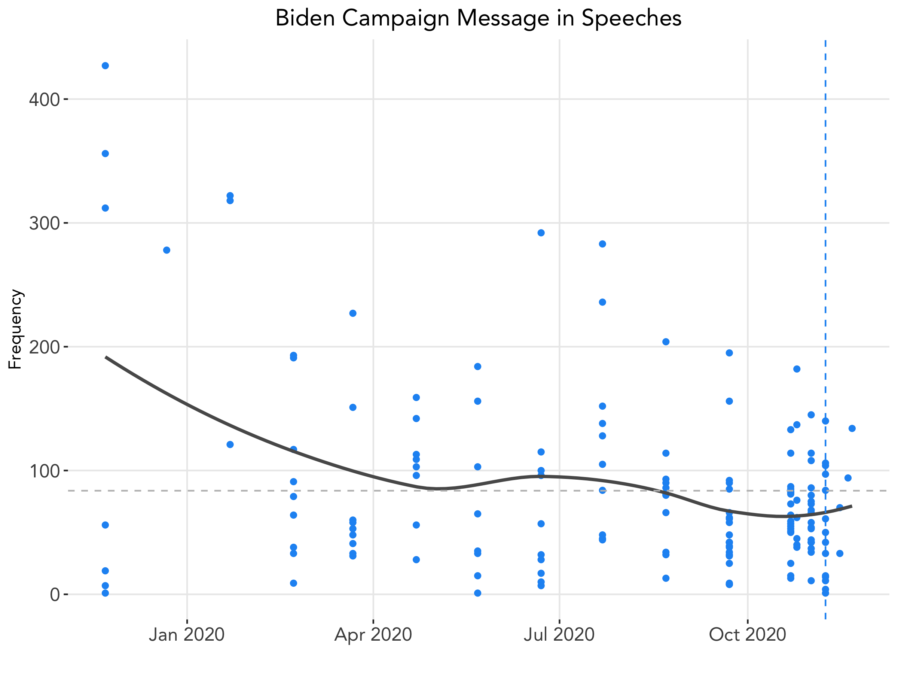
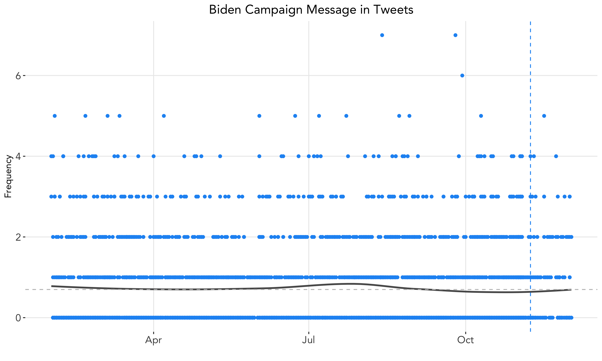

# Election Narratives
### December 10, 2020

After a presidential election, the media and campaigns speculate on possible narratives to explain why the election turned out the way it did. In our final blog post, we test a narrative on this year's election supporting Biden's win, claiming that the Biden campaign's message was effective in both mobilizing and persuading voters. To do so, we look at campaign speeches and Twitter data.

### The Media Narrative
Many news outlets have pointed out the focus on Biden's campaign around his [character](https://www.npr.org/2020/10/27/928258916/biden-and-trump-campaigns-stress-closing-themes-in-new-tv-ads). *The New York Times* Editorial Board coined Biden's campaign as the ["Decency Agenda"](https://www.nytimes.com/2020/12/05/opinion/sunday/joe-biden-presidency-style.html), declaring that
> "Joe Biden won the presidency because, at a moment when so many Americans were exhausted by the chaos and nastiness of the Trump era, he promised **stability**, **decency** and **healing**."

[Another narrative](https://www.campaignlive.com/article/5-ads-won-joe-biden/1699470) asserts that
> "Biden had a **simple** and **consistent** narrative theme that he threaded through his campaign from start to finish: '**decency versus division**'."

And not only was the central theme of the campaign's message important, but the [**consistency**](https://www.fastcompany.com/90573534/joe-bidens-ads-gave-you-all-the-feels-but-theyre-also-what-hurt-other-democrats) of the message as well; as one advertising executive notes,
> "President-elect Biden ran as a moderate looking to **bring decency back to the White House** and to **unite the country**. Go watch Biden’s campaign launch speech, squint, and watch his first speech as President-elect. **One brand**, well-positioned! Despite the crazy, Twitter-driven news cycle and the global pandemic, **the campaign maintained that message and tone**.”

We set out to test whether the message of Biden's campaign did hold steady throughout.

### Campaign Speeches
First we consider [transcripts](https://www.rev.com/blog/transcript-tag/joe-biden-transcripts) for any debates, public appearances, or campaign events in which Biden spoke, resulting in 160 total speeches from November 22, 2019, to November 21, 2020.

To test the narrative, we need to determine which words are most representative of Biden's overarching message. [Official campaign ad transcripts](http://livingroomcandidate.org/commercials/2020#) may provide some inspiration:
* "a man of faith, decency, and character"
* "We're in a battle for the soul of this nation."
* "bring back justice, respect, and dignity to the country"
* "Together they'll lead America, unite America, and heal America."
* It's time to go home. To a place we once knew. A country of kindness and compassion. Empathy and community. Tolerance and generosity. Integrity and hope. It's time to stand together in a place called America. The place we all call home. Joe Biden and Kamala Harris know the way. Let's go together. It's the only way we can go forward and build back better."

From messages like those above, we compile a list of approximately 30 words that are representative of Biden's overall message, including the following:

Then, we count up instances of each of these words across all of the transcript data. In addition to analyzing Biden's speech data, we can do the same for Trump's transcripts as well to provide us a comparison. Below plots the **frequency of the top 10 words selected in our dictionary of representative words for the Biden campaign message**, separated by candidate.

We can see that **Biden used all of the top 10 of our selected words more frequently than Trump, with the exception of the word "love"**. It is difficult to deduce in what context the two candidates used the word "love" in, and thus reasonable that Trump may have used this word that we associated with Biden's message more often. However, **the overall trend we see is that Biden did utilize such concepts as decency and character more than Trump did**.

### Time Series Analysis
To determine whether Biden's campaign message was _consistent_, we look at the frequency of our selected words over time using the date the speech was given. In the dataset, Biden appears to have given more than one speech on days in which he gave at least one speech. This may true given the nature of the campaign, but this could also be due to the data collection method of the website the transcripts were collected from.

The below figure plots the frequency of our dictionary of words for each speech, with each dot representing a unique speech. The gray vertical horizontal line represents the mean number of word occurrences across all 160 speeches at 83.7; the blue vertical line is placed on the day of Biden's victory speech. We also plot a locally weighted regression through the mean count for each day to visualize the overall trend.

It appears that **in general, the Biden campaign did stick to their message surrounding decency, although there was a slight decline over the one-year period leading up to the election**. Notably, the message was strongest in November 2019 -- perhaps in order to stand out from the other Democratic candidates, Biden really tried to drive home his message and differentiate himself before the Democratic primaries.

Post-election, Biden and Harris's victory speech had 97 occurrences of words from our dictionary, putting that speech right above the average. Although there are few data points after Biden was declared the president-elect, it appears that the campaign's message remained relatively consistent.

### Twitter Analysis
We can also test the consistency of Biden's campaign message by looking to Twitter, an increasingly influential medium through which voters may be mobilized or persuaded. Our dataset includes the 3200 tweets from the official Biden account from February 1, 2020, to December 2, 2020.

We plot the frequency of our dictionary of words, this time with each dot representing a unique tweet. The gray vertical horizontal line represents the mean number of word occurrences across all tweets at 0.70, and the blue vertical line is the day of Biden's victory speech. Again, we also plot a locally weighted regression through the mean count for each day to visualize the overall trend.

This graph shows **remarkable consistency of Biden's campaign message on Twitter**. Of course, messages conveyed through Twitter provide much smaller snapshots than an entire debate transcript does, and there are many occurrences in which Biden did not use any of the words selected in our dictionary in his tweets, all of which could influence our findings here. Nevertheless, this gives us a general trend for his Twitter messaging.

### A Campaign of Character

